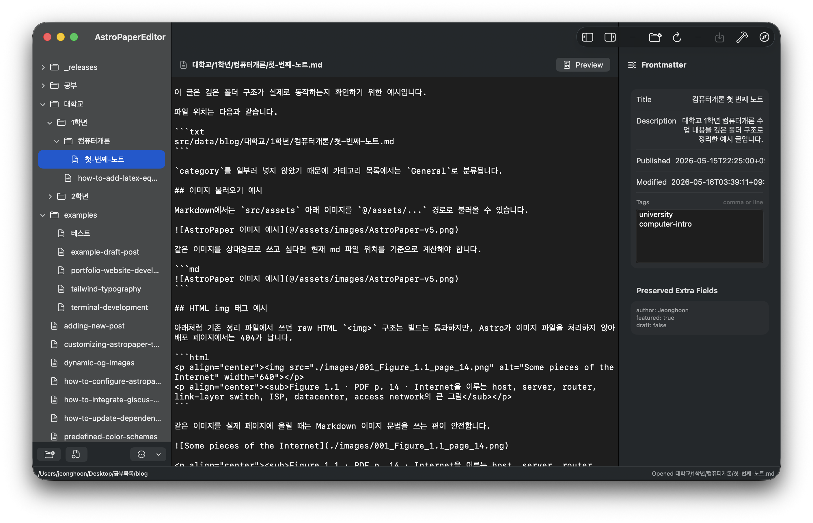
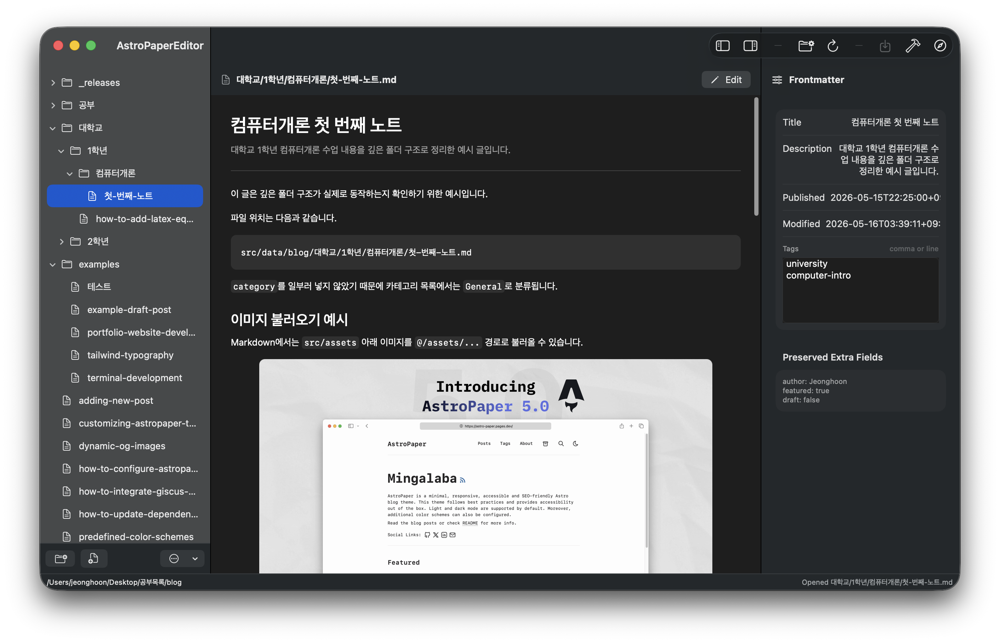

# AstroPaperEditor

A lightweight macOS editor for AstroPaper blogs.

AstroPaperEditor is not a general-purpose note app. It is a focused local file editor that keeps posts inside AstroPaper's `src/data/blog` folder structure, reduces repetitive frontmatter work, and lets the original Markdown files stay visible on disk.



## What It Does

- Shows the `src/data/blog` folder tree as the blog category structure
- Treats folders as categories and `.md` files as posts
- Creates new categories, subcategories, and Markdown posts
- Generates AstroPaper-compatible frontmatter for new documents
- Edits Markdown body content without autosaving
- Provides a frontmatter inspector for title, description, dates, tags, and preserved extra fields
- Supports manual save with `Command + S`
- Updates `modDatetime` only when saving
- Supports edit and preview modes with `Command + E`
- Renders Markdown preview with tables, images, Mermaid, and LaTeX support
- Saves pasted or dropped images into `src/assets/images`
- Runs Docker build only when the user presses Build
- Opens the local blog at `http://localhost:8080/`
- Provides Preferences for About page, Home settings, and social links



## Design Goals

AstroPaperEditor is built around a few strict rules:

- No database
- No autosave
- No automatic builds
- No background file watcher
- No always-on full-text indexing
- Scan the blog tree once at launch or on manual reload
- Read a document only when it is selected
- Keep edits in memory until the user saves
- Ask before discarding unsaved changes

The point is to make it difficult to accidentally break the AstroPaper structure while keeping the project as normal files that can still be edited in Finder or another editor.

## Expected AstroPaper Layout

The app expects an AstroPaper project with this post root:

```text
src/data/blog/
```

Folder paths become category paths. For example:

```text
src/data/blog/대학교/1학년/컴퓨터개론/첫-번째-노트.md
```

is treated as:

```text
대학교 -> 1학년 -> 컴퓨터개론 -> 첫 번째 노트
```

## Site Settings

Home and social settings are edited through a small dedicated TypeScript settings file:

```text
src/user-settings.ts
```

`src/config.ts` should read `USER_SITE`, and `src/constants.ts` should read `USER_SOCIALS`. This keeps AstroPaper's normal config files simple while giving the macOS app one predictable file to edit.

Example shape:

```ts
export const USER_SITE = {
  website: "http://localhost:8080/",
  author: "Jeonghoon",
  profile: "http://localhost:8080/about/",
  desc: "Personal technical notes",
  title: "Home Server Notes",
  postPerIndex: 4,
  home: {
    title: "Home Server Notes",
    description: ["Study notes and project logs."],
    readMore: {
      text: "Read the blog posts or check",
      linkText: "README",
      href: "https://github.com/satnaing/astro-paper#readme",
    },
    socialLabel: "Social Links:",
    allPostsText: "All Posts",
  },
} as const;

export const USER_SOCIALS = [
  {
    name: "GitHub",
    enabled: true,
    href: "https://github.com/username",
  },
] as const;
```

## Build And Run

This is a Swift Package based macOS app.

Build:

```bash
swift build
```

Run as an app bundle:

```bash
./script/build_and_run.sh
```

Create a distributable local app bundle:

```bash
./script/package_app.sh
```

The generated app bundle is written to:

```text
dist/AstroPaperEditor.app
```

## Default Blog Path

The app is currently set up for this local AstroPaper project path:

```text
/Users/jeonghoon/Desktop/공부목록/blog
```

You can choose another AstroPaper project folder from inside the app.

## Requirements

- macOS
- Swift toolchain / Xcode command line tools
- AstroPaper blog project
- Docker, if you want to use the Build button

## Current Status

This is a focused personal tool for editing an AstroPaper blog. The core editing, preview, frontmatter, image insertion, settings, and build workflows are implemented, but the app is intentionally small and local-first.
