# AstroPaperEditor

A focused macOS editor for AstroPaper blogs.

AstroPaperEditor is a local file editor, not a database-backed writing app. It opens an AstroPaper project, reads posts from `src/data/blog`, edits Markdown and frontmatter, and leaves the project as normal files on disk.

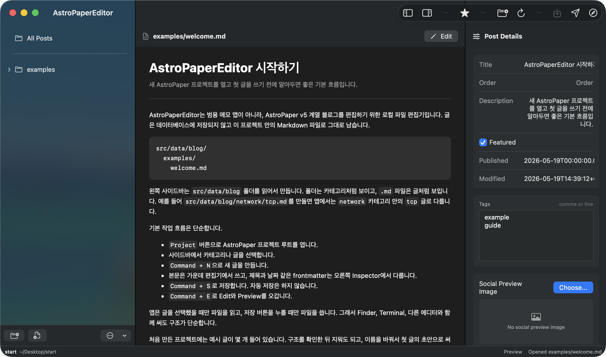

## Download

Download the latest build from GitHub Releases:

[AstroPaperEditor releases](https://github.com/leokang123/astro-editor/releases)

The release includes:

- `AstroPaperEditor-v0.4.1.dmg`
- `AstroPaperEditor-v0.4.1.zip`

Open the DMG and move `AstroPaperEditor.app` to your Applications folder.

## macOS Security Notice

AstroPaperEditor is not notarized yet, so macOS may block it the first time you open it.

If this happens:

1. Try opening `AstroPaperEditor.app` once.
2. When macOS blocks it, open **System Settings**.
3. Go to **Privacy & Security**.
4. Scroll to the bottom of the page.
5. Click **Open Anyway** for AstroPaperEditor.
6. Confirm the prompt to launch the app.

Only use **Open Anyway** if you downloaded the app from this repository's official GitHub Releases page.

## What It Is For

AstroPaperEditor is built for editing an AstroPaper v5-style blog project from a native macOS app.

It helps with:

- Opening an existing AstroPaper project folder
- Creating a new starter project in an empty folder
- Browsing `src/data/blog` as a post/category tree
- Creating categories and Markdown posts
- Editing Markdown body text
- Previewing rendered posts locally inside the app
- Editing title, description, dates, tags, and featured status
- Managing About, Home, Social, Assets, Git, and Developer settings
- Opening the generated site in the browser

It intentionally does not use a database or autosave. Files are read when selected, edited in memory, and written when you save.

## Start A Project

Open AstroPaperEditor and choose an AstroPaper project folder. If the selected folder is empty, the app can create a starter project for you.

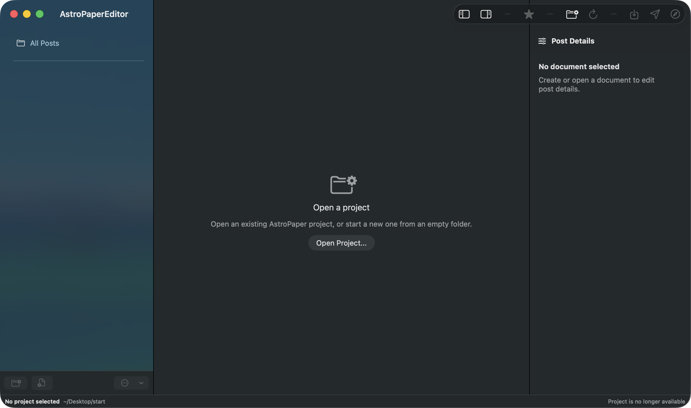

Choose or create a folder for the project.

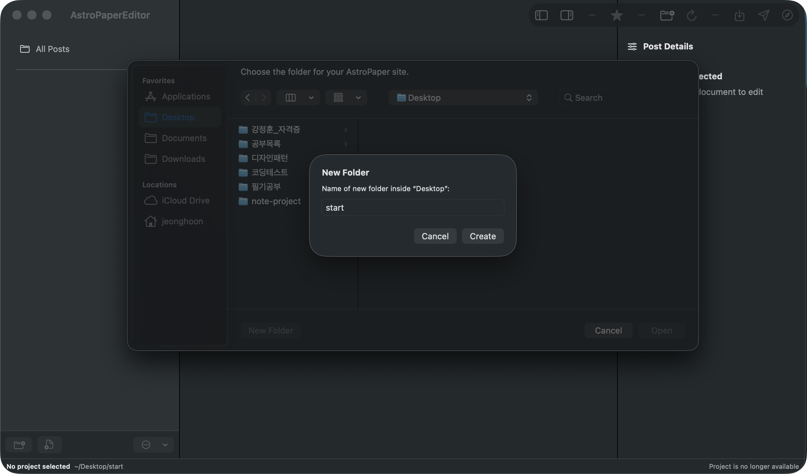

If the folder is empty, create a new AstroPaper project from the bundled starter.

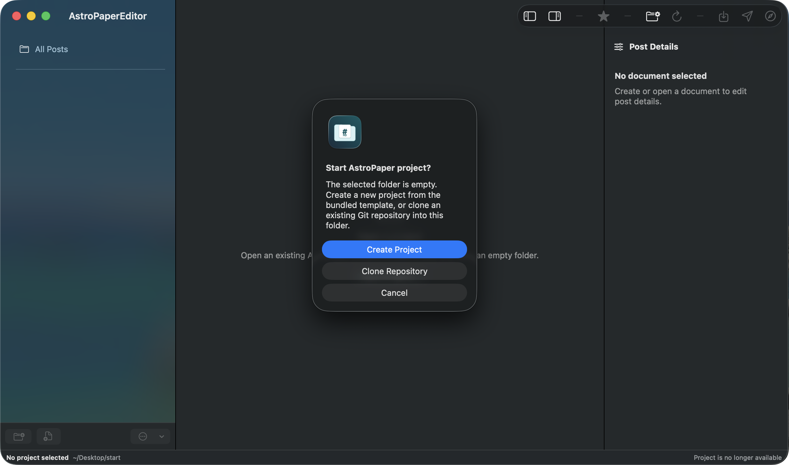

## Edit Posts

Folders under `src/data/blog` appear as categories in the sidebar. Markdown files appear as posts.

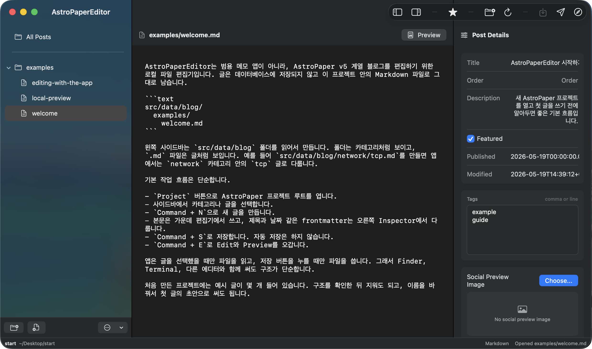

The editor keeps the Markdown file structure visible:

```text
src/data/blog/
  examples/
    welcome.md
```

Use the sidebar to select a post, edit the Markdown body in the center, and update frontmatter from the inspector on the right.

Useful shortcuts:

- `Command + N`: create a new post
- `Command + S`: save the current document
- `Command + E`: switch between Edit and Preview
- `Command + F`: open Find, including from Preview mode

## Preview Posts

Preview mode renders the current Markdown post inside the app.


The preview supports common Markdown output, local images, tables, Mermaid diagrams, and math rendering when the project includes the required AstroPaper assets.

## AstroPaper Base And Site Customizations

AstroPaperEditor works with a starter site based on [AstroPaper](https://github.com/satnaing/astro-paper), an Astro blog theme by Sat Naing and contributors. AstroPaperEditor is a separate editor app, not an official AstroPaper project.

The bundled starter keeps the AstroPaper foundation, then customizes the blog structure for a more organized writing workflow:

- Nested folders under `src/data/blog` are used as category paths.
- `order` frontmatter can be used to control post and category ordering.
- Post list pages can show preview images instead of text-only entries.

These customizations belong to the AstroPaper starter site. The macOS app edits that structure, but the final website is still produced by the AstroPaper/Astro project itself.

## Site Output

AstroPaperEditor edits the local project. The actual website is still generated by AstroPaper.

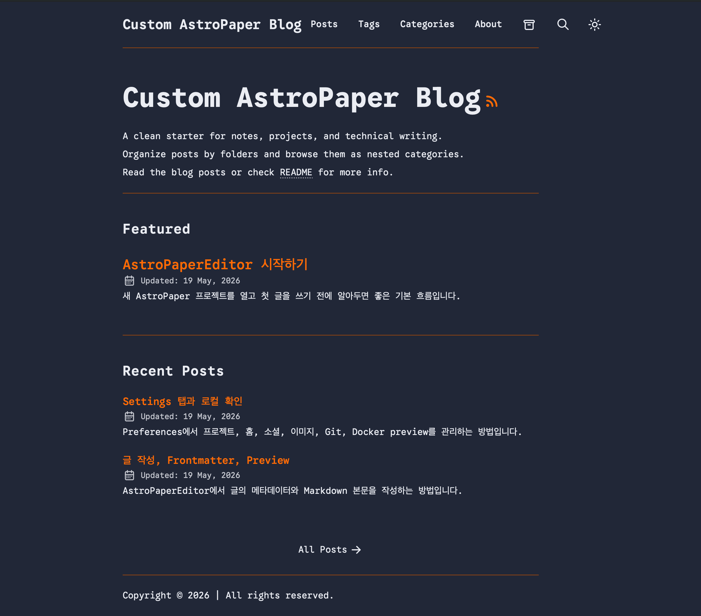

Use **Open Website** from the app when you want to open the configured site URL in your browser.

## Preferences

Project preferences show the important local paths and editor options.

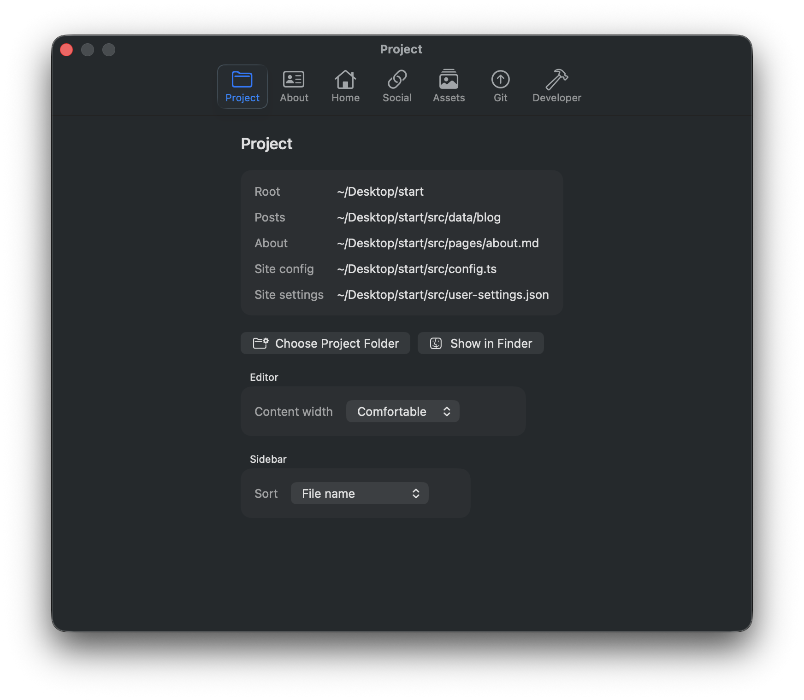

### About

Edit the About page body and replace the profile image.

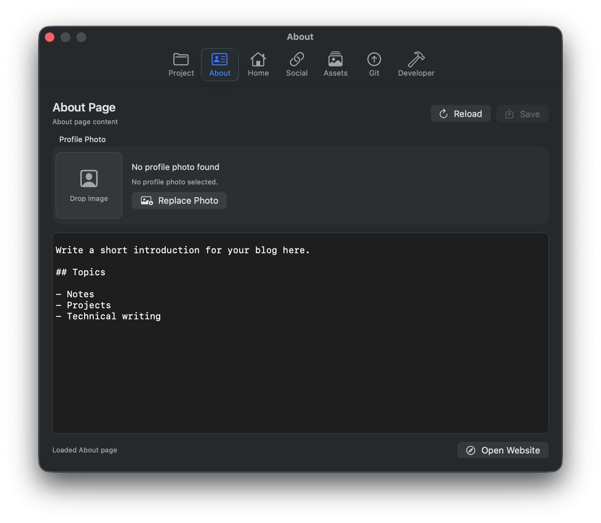

### Home

Edit site title, description, author, website URL, profile URL, and home page labels.

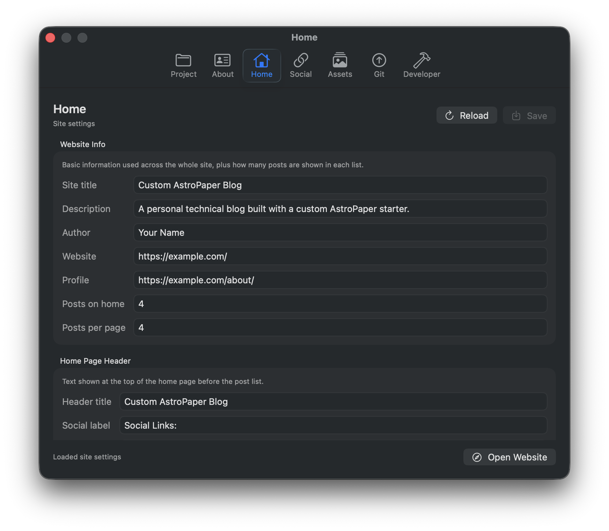

### Social

Enable and configure social links used by the AstroPaper site.

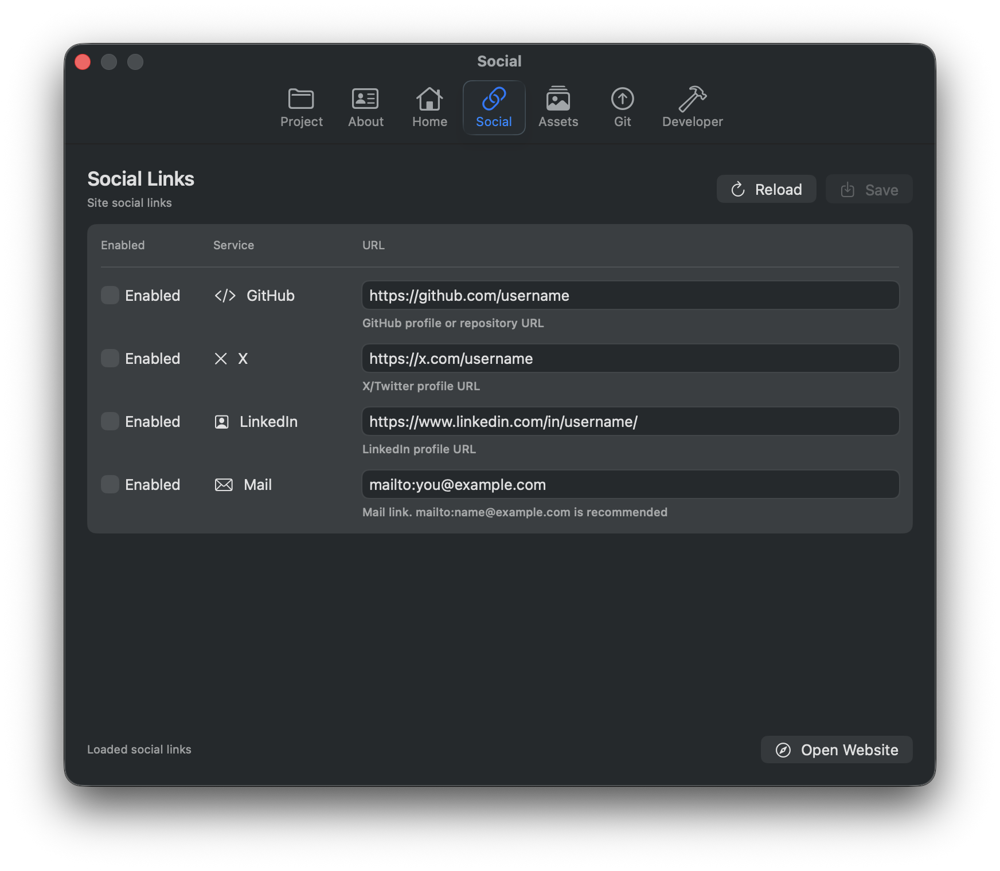

### Assets

Scan site images and move unused files to the macOS Trash.

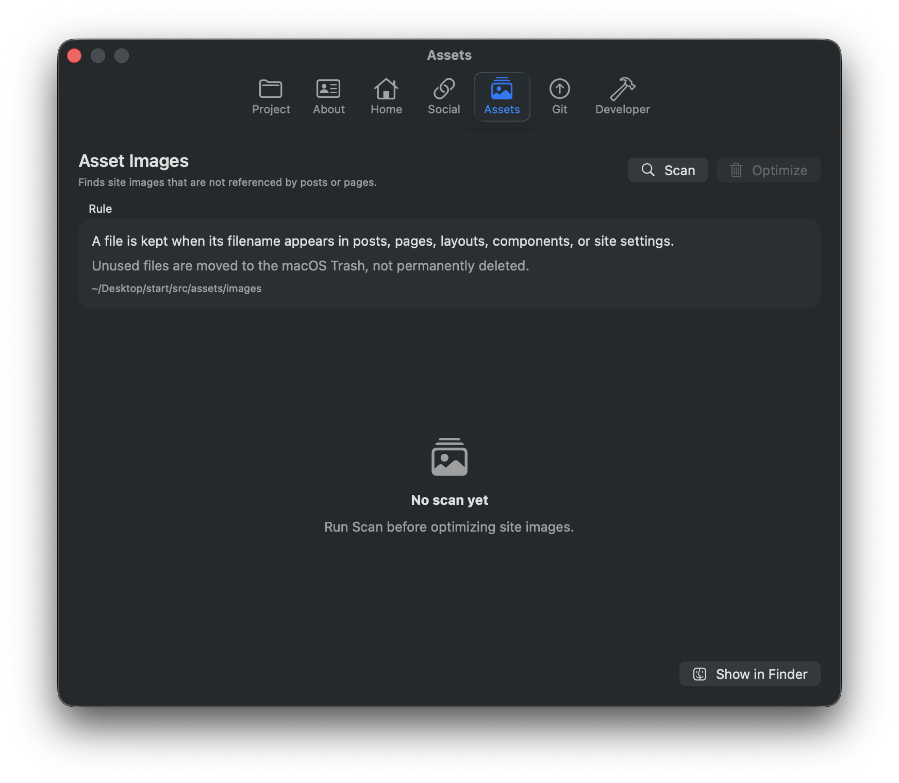

Unused images are not permanently deleted.

### Git

Configure the Git repository used by Commit & Push.

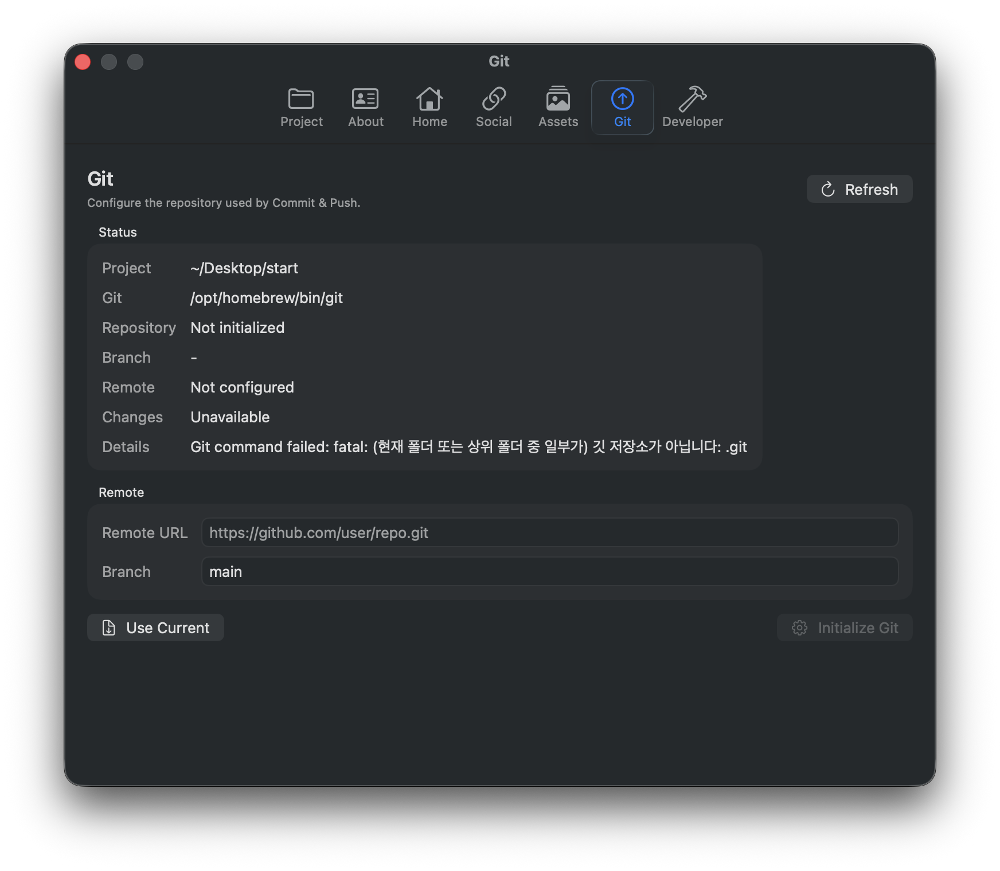

The app can initialize a repository, set a remote, and push the selected project when you are ready to deploy.

### Developer

Run the manual Docker preview build for local development checks.

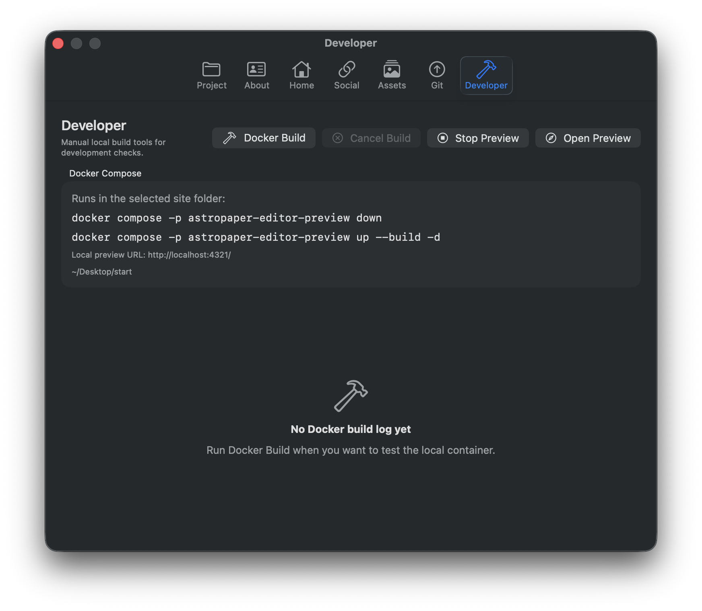

Docker build is intentionally manual. The app does not run background builds automatically.

## Expected Project Layout

AstroPaperEditor expects this post root:

```text
src/data/blog/
```

Folder paths become category paths. For example:

```text
src/data/blog/network/tcp.md
```

is shown as:

```text
network -> tcp
```

The app also reads and writes site settings through:

```text
src/user-settings.json
```

If `src/user-settings.json` is missing, AstroPaperEditor creates a starter file when settings are loaded.

## Build From Source

This is a Swift Package based macOS app.

Build:

```bash
swift build
```

Run as an app bundle:

```bash
./script/build_and_run.sh
```

Create a local app bundle:

```bash
./script/package_app.sh
```

Create release assets:

```bash
./script/create_release_assets.sh
```

Generated files are written to:

```text
dist/
```

## Requirements

- macOS
- An AstroPaper project, or an empty folder for a new starter project
- Git, if you want Commit & Push
- Docker, only if you want the manual local preview build
- Swift toolchain / Xcode command line tools, only if building from source

## Status

AstroPaperEditor is a small local-first tool for editing AstroPaper blogs. It is intentionally conservative: no database, no autosave, no background watcher, and no automatic build process.

## Acknowledgement

AstroPaperEditor was developed with help from OpenAI Codex.
